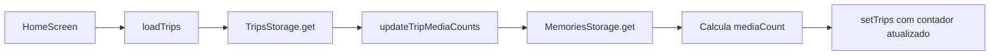
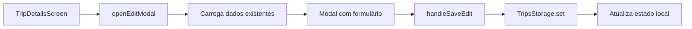

# Arquitetura do Projeto - Mobile

## 🏗️ Visão Geral
O aplicativo é construído utilizando **React Native** com **Expo** e **TypeScript**. A navegação é gerenciada pelo `React Navigation` (Stack e Bottom Tabs).

## 📱 Stack Tecnológico

### Core
- **React Native**: Framework mobile multiplataforma
- **Expo SDK 52**: Plataforma de desenvolvimento e build
- **TypeScript**: Type safety e melhor DX

### Navegação
- **@react-navigation/native**: Core de navegação
- **@react-navigation/stack**: Navegação em pilha (screens)
- **@react-navigation/bottom-tabs**: Tabs inferiores (Home, Memories, Budget, Profile)

### UI/UX
- **@expo/vector-icons** (MaterialIcons): Biblioteca de ícones
- **@react-native-community/datetimepicker**: Seleção de datas
- **expo-image-picker**: Seleção de fotos/câmera
- **StyleSheet.create**: Estilização nativa

### Persistência
- **@react-native-async-storage/async-storage**: Storage local key-value
- Camada de abstração em `src/utils/storage.ts`

## 📂 Estrutura de Arquivos

```
mobile/
├── App.tsx                    # Entry point, navegação raiz
├── src/
│   ├── screens/               # Telas do app
│   │   ├── HomeScreen.tsx
│   │   ├── TripDetailsScreen.tsx
│   │   ├── NewTripScreen.tsx
│   │   ├── MemoriesScreen.tsx
│   │   ├── BudgetScreen.tsx
│   │   └── ProfileScreen.tsx
│   ├── types.ts               # Definições de tipos TypeScript
│   └── utils/
│       └── storage.ts         # Abstração de AsyncStorage
├── doc/                       # Documentação
└── package.json
```

## 🗄️ Gerenciamento de Estado e Dados

### Estado Local
- **useState**: Estados de UI e formulários
- **useEffect**: Side effects e carregamento de dados
- **useFocusEffect**: Recarregamento ao retornar à tela

### Persistência de Dados

Utilizamos **AsyncStorage** para salvar dados localmente no dispositivo. Criamos uma camada de abstração em `src/utils/storage.ts` para padronizar o acesso aos dados.

#### Entidades e Storage

| Storage | Dados | Key |
|---------|-------|-----|
| `TripsStorage` | Viagens (Trip[]) | `@trips` |
| `MemoriesStorage` | Fotos e metadados (Memory[]) | `@memories` |
| `ProfileStorage` | Avatar e config (Profile) | `@profile` |
| `TasksStorage` | Tarefas (Task[]) | `@tasks` |
| `BookingsStorage` | Reservas (Booking[]) | `@bookings` |
| `ExpensesStorage` | Despesas (Expense[]) | `@expenses` |

#### Padrão de Storage

```typescript
// src/utils/storage.ts
export const TripsStorage = {
  get: async (): Promise<Trip[] | null> => { ... },
  set: async (trips: Trip[]): Promise<void> => { ... },
};
```

## 🎨 Padrões de Código

### Componentes Funcionais
- Todas as telas são **React Functional Components**
- Hooks do React para lógica e estado
- TypeScript para props e tipos

### Estilização
- **StyleSheet.create**: Performance otimizada
- **Cores Consistentes**: Palette definida
  - Primary: `#137fec` (azul)
  - Success: `#10b981` (verde)
  - Danger: `#ef4444` (vermelho)
  - Gray: `#6b7280`, `#9ca3af`, `#e5e7eb`

### Tipos TypeScript

```typescript
// src/types.ts
export interface Trip {
  id: string;
  destination: string;
  country: string;
  dateRange: string;
  startDate?: Date | string;
  endDate?: Date | string;
  imageUrl?: string;
  status: 'upcoming' | 'ongoing' | 'completed';
  mediaCount: number;
  notes?: string;
}

export interface Memory {
  id: string;
  trip: string;
  image: string;
  date: string;
}

export interface Expense {
  id: string;
  tripId: string;
  description: string;
  amount: number;
  category: ExpenseCategory;
  date: string;
}

export type ExpenseCategory = 
  | 'food' | 'transport' | 'accommodation' 
  | 'shopping' | 'activities' | 'health' 
  | 'leisure' | 'emergency' | 'gifts' | 'others';
```

## 🔄 Fluxos Principais

### 1. Home → Lista de Viagens


### 2. Adicionar Memória


### 3. Editar Viagem


### 4. Adicionar Despesa


## 🧩 Padrões de Componentização

### Screen Components
Cada tela é auto-contida com:
- Lógica de `load*` para buscar dados
- Handlers `handle*` para ações
- Modais internos quando necessário
- Estilos locais com `StyleSheet.create`

### Reutilização
- **Ícones**: `MaterialIcons` consistente
- **Botões**: Padrões de botão tracejado, principal, secundário
- **Cards**: Estrutura similar em todas as listas

## 🔒 Type Safety

### Props Tipadas
```typescript
interface Props {
  navigation: TripDetailsNavigationProp;
  route: TripDetailsRouteProp;
}
```

### Storage Tipado
```typescript
const trips: Trip[] | null = await TripsStorage.get();
```

### Type Guards
```typescript
expense.category as ExpenseCategory  // Cast quando necessário
```

## 📊 Performance

### Otimizações
- **FlatList**: Para listas longas (Memórias)
- **useFocusEffect**: Evita reloads desnecessários
- **Cálculos derivados**: `useMemo` para filtros complexos
- **AsyncStorage**: Storage local rápido (sem network)

### Lazy Loading
- Imagens carregadas sob demanda
- Dados carregados apenas ao navegar para tela

## 🔮 Futuro: Backend Integration

### Planejado
- **Supabase**: Database PostgreSQL
- **Auth**: Social login (Google, Apple)
- **Storage**: Imagens em bucket S3-compatible
- **Real-time**: Sync multi-dispositivo

### Estrutura Preparada
- Camada de `storage.ts` facilita migração de AsyncStorage → API
- Tipos TypeScript prontos para interfaces de API

---

**Versão**: v2.1 (Janeiro 2026)  
**Linguagem**: TypeScript 5.x  
**React Native**: Expo SDK 52
